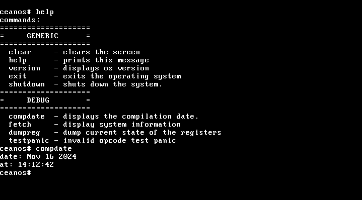

# CeanOS 

  > CeanOS is a UNIX-like operating system . The goal is to create a lightweight, efficient OS with a custom kernel and a user-friendly interface. This project is built with C and assembly using no standard libraries . 

 

#### warning -> i took `rc` versioning instead of `alpha` and `beta` because it sounds more professional and cooler 

## Kernel Status
The CeanOS kernel is a monolithic x86 one. I am also planning to port it to x86_64 and arm after im done with x86 .

## Other Information
The file `vga_types.h` contains macros taken from the Linux source code, which can be found [here](https://github.com/torvalds/linux/blob/42f7652d3eb527d03665b09edac47f85fb600924/include/video/vga.h).

The files `ata.c` and `ata.h` are taken from [this](https://github.com/malwarepad/cavOS/blob/2ad71233123bf610188cc6d4d3cda30d8e275909/src/kernel/drivers/) location(malwarepad/cavOS) with some modifications to integrate into CeanOS . 

## Goals
- **Kernel**
  - [x] Basic kernel operations
  - [ ] Usable terminal
- **Architecture**
  - [x] x86 (WIP)
  - [ ] x86_64
  - [ ] ARM
- **Filesystems**
  - [ ] FAT32 boot sector
  - [ ] FAT32 read
  - [ ] ext2 read
  - [ ] FAT32 write
  - [ ] ext2 write
  - [x] VFS
  - [x] tmpfs (WIP)
- **Device Drivers**
  - [x] Generic: Keyboard, VGA, PIT
  - [ ] Storage: SSD, USB, HDD, AHCI
  - [ ] ACPI and others
- **Networking**
  - [ ] Drivers: idk
  - [ ] Additional features: idk (still researching)
- **Graphics**
  - [x] VGA text mode
  - [ ] Framebuffer, GUI, idk?
  - [ ] cwm (cean windows manager) (maybe WIP)

## Compiling
Everything about it can be found in `docs/build.md` or [here](docs/build.md)

## License
This project is licensed under GPL v3 (GNU General Public License v3.0). For more information, see the [LICENSE](LICENSE).
